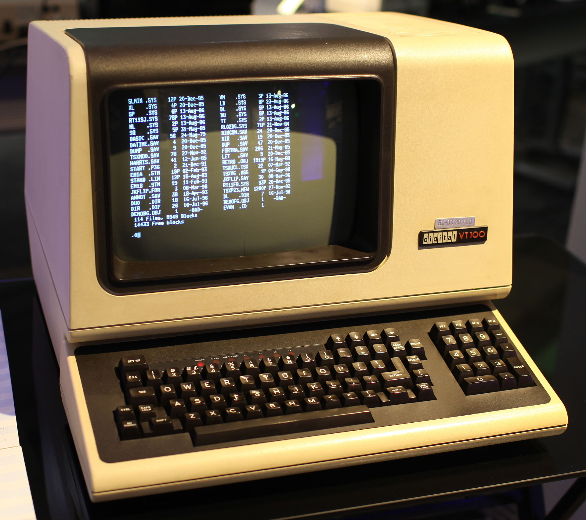
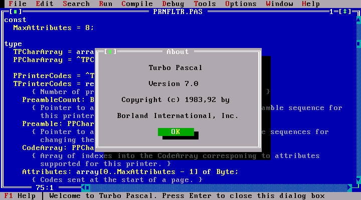
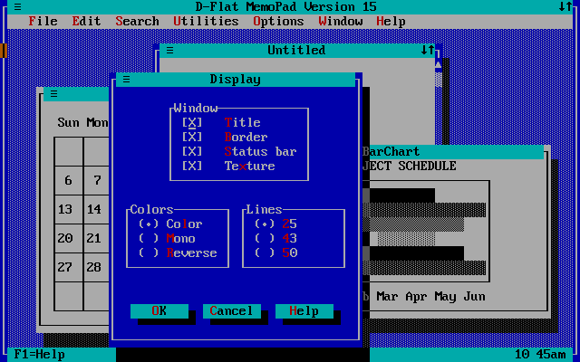
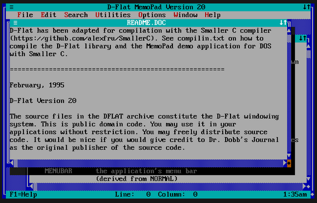

ANSI Escape Sequences:
----

# Standardized codes to control various aspects of text output in terminal:
* **Text Formatting:** Styles _(Bold, italic)_ & Background and foreground colors of each cell.
* **Cursor Movements** in the terminal 
* **Additional Functions:** like screen redraw _(partly or whole)_ & Other effects _(bells...)_

<!--pause -->

# DEC VT100 Terminal
One of the first devices to implement ANSI escape sequences in the late 1970s.
<!-- column_layout: [1, 3, 1] -->
<!-- column: 1 -->


<!-- end_slide -->

Turbo Vision:
----
Turbo Vision was a framework for creating text-mode user interfaces. It provided features like windowing, menus, and event handling, influencing many later TUI libraries and approaches.



-
-
<!-- column_layout: [1, 10, 10, 1] -->
<!-- column: 1 -->

<!-- column: 2 -->


<!-- end_slide -->

TUIs Concepts
----

* The terminal display is treated as a grid of cells, where each cell holds a character and its style information.
* Using ANSI escape sequences we can control the style of each cells.
* Simple input handling (Keystroke, mouse events with the associated cell, Terminal resize, etc).

<!--pause-->

# Example: UTF-8 Characters for borders.

<!-- column_layout: [1, 5, 5, 1] -->

<!-- column: 1 -->
```rust
/// Border Set with a single line width
///
/// ┌─────┐
/// │xxxxx│
/// │xxxxx│
/// └─────┘
pub const PLAIN: Set = Set {
    top_left: "┌",
    top_right: "┐",
    bottom_left: "└",
    bottom_right: "┘",
    vertical_left: "│",
    vertical_right: "│",
    horizontal_top: "─",
    horizontal_bottom: "─",
};
```
<!-- column: 2 -->
```rust
/// Border Set with a double line width
///
/// ╔═════╗
/// ║xxxxx║
/// ║xxxxx║
/// ╚═════╝
pub const DOUBLE: Set = Set {
    top_left: "╔",
    top_right: "╗",
    bottom_left: "╚",
    bottom_right: "╝",
    vertical_left: "║",
    vertical_right: "║",
    horizontal_top: "═",
    horizontal_bottom: "═",
};
```
<!--end_slide-->

TUI Advantages
----

# Real Cross-Platform:

* ANSI sequences are stable and standardized since the 80s. 
* Support in all terminal emulators _(even Windows since 2019)_
* Runs even on Server and in SSH sessions.

<!--pause-->

# Simplified UI Management: 
* With the UI represented as a grid of cells, developers avoid complexities associated with varying screen resolutions and graphical rendering challenges.
* **Immediate Rendering Approach**: 
  - UI doesn't have any state.
  - No need for bindings to keep state in sync.
  - Full control about rendering.

<!--pause-->

# Advantages for users:
* **Fast Startup and Performance:** TUI applications are lightweight, have instant startup times and minimal resource usage.
* **Keyboard-Driven Workflow:** More on that in the showcases.

<!-- end_slide -->

TUI Crate: RATATUI
----
# Features: 
* **Widgets:** https://ratatui.rs/examples/widgets/ 
* **Examples:** https://github.com/ratatui/ratatui/tree/main/examples
* **Templates:** https://github.com/ratatui/templates/

# Widgets & Apps:
* **Awesome Ratatui:** https://github.com/ratatui/awesome-ratatui


<!-- end_slide -->

TUI Apps:
----

<!-- column_layout: [1, 1, 1] -->
<!-- column: 1 -->
* Present-Term
* GitUI
* LazyGit
* Tui-Journal
* Tui-Casino
* Yazi
* Fzf
* Htop & Btop & Bottom
* Chess-tui
* Systemctl-tui
* manga-tui
* Helix
* Neovim

<!-- end_slide -->

<!-- jump_to_middle -->

The end
---
